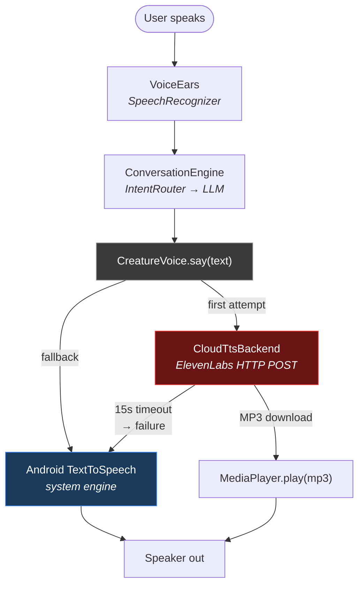
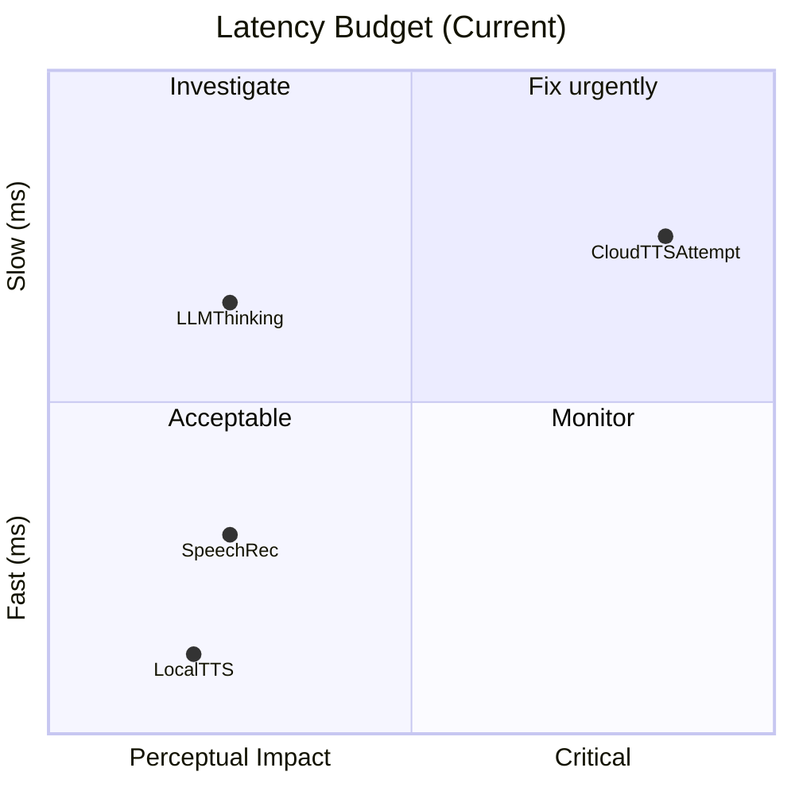
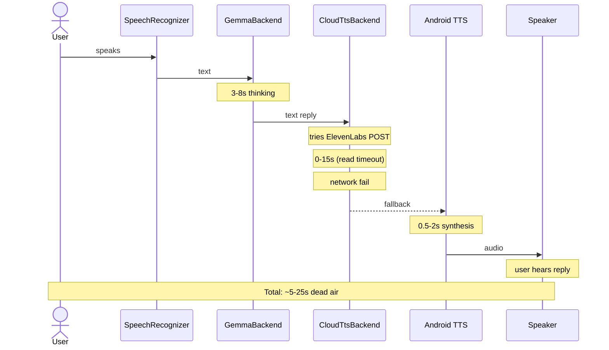
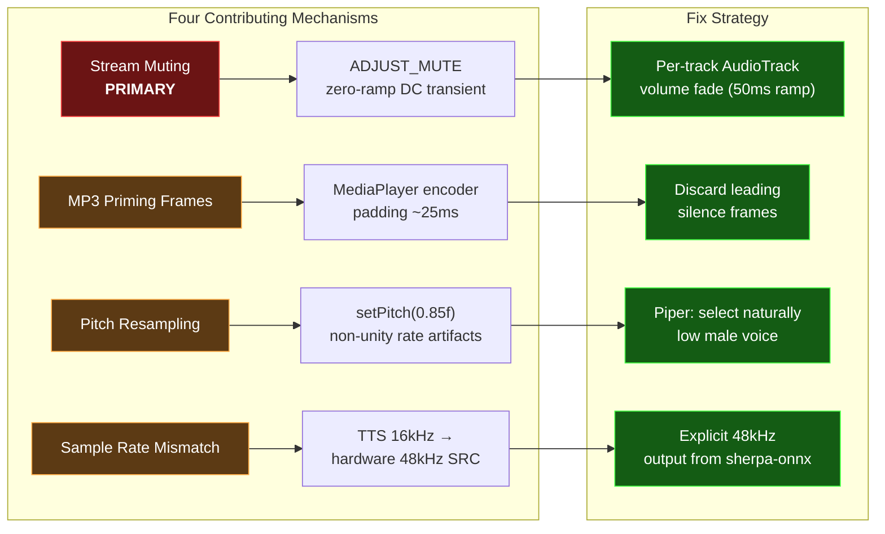
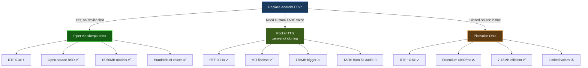
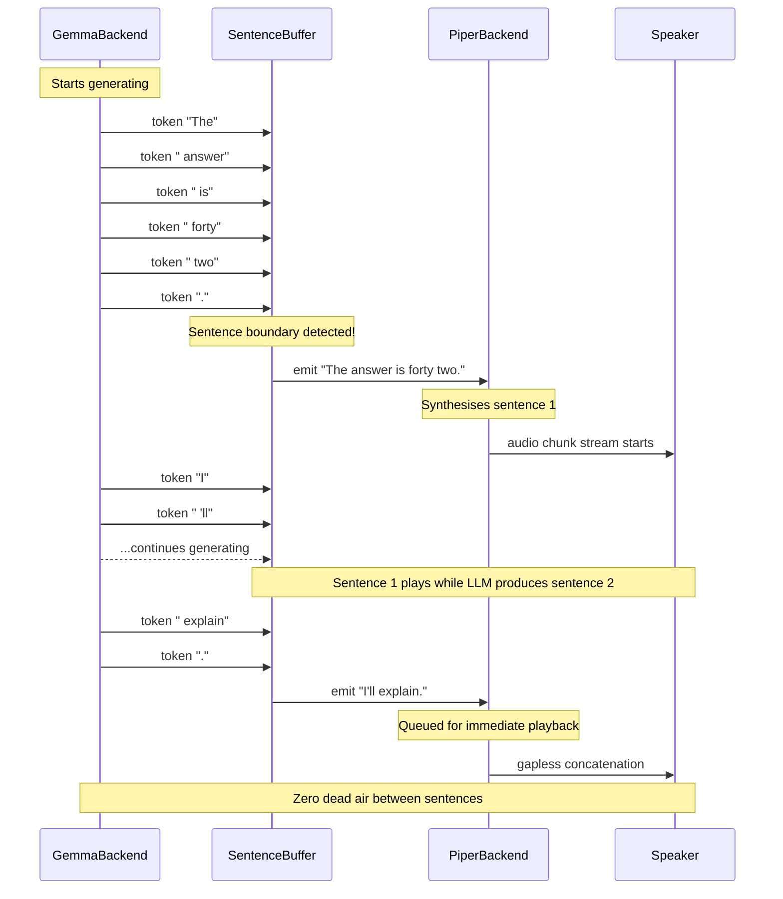

# SMOLCASE Deep Research: Voice System Latency, Audio Quality & On-Device TTS Engine Selection

> **Date:** 2026-08-31
> **Subject:** Comprehensive analysis of the SMOLCASE voice pipeline — known bugs (latency, audio popping/crackling, echo cooldown limitations), root cause analysis of the speaker distortion, survey of three on-device TTS engine replacements (Piper, NekoSpeak ecosystem, Picovoice Orca), and a phased refactoring roadmap.
> **Sources:** Android source code audit, logcat analysis, sherpa-onnx docs, GitHub (NekoSpeak, HayaiTTS, VoxSherpa), Picovoice benchmark reports, Android audio engineering docs.
> **Informs:** [[AGENTS]] §4, [[docs/06-specs/2026-08-16-tars-face-persona-design]], [[TASKS]] conversation quality tickets
> **See also:** [[docs/01-research/SMOLCASE-GrowBot-Reverse-Engineering]] §3.7 (original multi-engine TTS vision)

---

## 1. Executive Summary

The SMOLCASE voice system has three interconnected problems that degrade the user experience:

1. **Latency**: The serial pipeline (wait for LLM → try cloud TTS first → fall back to local TTS) introduces 3-10s of dead air before the first spoken word. The current Android `TextToSpeech` engine has no streaming capability — the entire utterance must be synthesised before playback starts.

2. **Audio popping/crackling**: The speaker produces audible transients (pops) on certain words. Root cause analysis points to instantaneous `ADJUST_MUTE`/`ADJUST_UNMUTE` calls creating DC offset transients, combined with potential sample-rate mismatches and resampler artifacts from the `setPitch(0.85f)` / `setSpeechRate(0.92f)` tuning.

3. **Echo cooldown fragility**: The 2.5s software gate (`VoiceEars.cooldown()`) blocks re-triggering from ambient playback, but the stream-level mute/unmute cycling (`ADJUST_MUTE` on `STREAM_MUSIC`) is itself a source of audio artifacts.

**Primary recommendation**: Replace the Android system `TextToSpeech` with **Piper TTS via sherpa-onnx** — direct integration via ONNX Runtime AAR, `AudioTrack` streaming playback, and full pipeline control. This is the best latency-to-quality-to-reliability ratio for SMOLCASE's constraints (open source, 0.3x RTF, 15-50MB models, 80MB RAM, hundreds of community voices).

---

## 2. Current Architecture & Pain Points

### 2.1 Data Flow



### 2.2 Known Latency Chain

| Stage | Component | Typical Time | Notes |
|-------|-----------|-------------|-------|
| Speech recognition | `SpeechRecognizer` | ~1-3s | On-device, varies by phrase length |
| LLM thinking | `GemmaBackend`/etc | ~3-8s | Degrades from 3.5s → 10s+ over session (bug 20260830-002) |
| Cloud TTS attempt | `CloudTtsBackend` | 0-15s | Fires HTTP POST, waits for MP3; 15s read timeout |
| Local TTS fallback | Android `TextToSpeech` | ~0.5-2s | After cloud fails/timeout |
| **Total perceived** | | **~5-25s** | |



The cloud TTS first-attempt path is particularly damaging: `CreatureVoice.say()` (line 63) calls `cloudTts.speak(text)` which fires a blocking network request. If the network is slow or unavailable (desk robot with intermittent WiFi), the user waits the full 15s read timeout before falling back to local TTS. This is the wrong default — on-device TTS should be primary, cloud secondary.

### 2.3 `pickVoice()` Network Preference Bug

In `CreatureVoice.kt` line 88-93, the voice selection sorts by `isNetworkConnectionRequired` — putting network-dependent voices (`en-us-x-iom-network`, `en-gb-x-gbb-network`) ahead of local voices. Network voices require a data fetch for *every utterance*, adding 1-3s per reply. The preference list should be inverted to prefer `*-local` voices.

### 2.4 Known Bugs Register

| ID | Bug | Root Cause | Severity |
|----|-----|-----------|----------|
| 20260830-002 | Latency degrades 3.5s → 10s+ | `maxNumTokens=1024` (LiteRT-LM prompt processing scales with token budget) | 🔴 |
| 20260830-006 | Echo cooldown leaks utterances | Software gate only; doesn't stop mic from hearing TTS. Cooldown timer vs. room echo decay race. | 🟢 |
| — | **Audio popping/crackling** (unregistered) | Multi-factor: instant stream mutes, MediaPlayer priming, resampler artifacts | 🟡 |

### 2.5 Latency Waterfall: Why the User Waits ~5-25s Per Reply




---

## 3. Audio Popping / Crackling — Root Cause Analysis



Four contributing mechanisms, ordered by likelihood:

### 3.1 Primary Cause: Instantaneous Stream-Level Muting (ADJUST_MUTE/ADJUST_UNMUTE)

`VoiceEars.applyStreamMute()` (lines 37-42) calls `AudioManager.adjustStreamVolume(stream, ADJUST_MUTE, 0)` on `STREAM_MUSIC`, `STREAM_SYSTEM`, and `STREAM_NOTIFICATION`. The `ADJUST_MUTE` flag applies a **digital mute with zero ramp time** — the audio signal is cut at the current sample point. This creates a DC transient (a step function in the waveform) which the speaker translates into an audible click/pop.

The muting is toggled multiple times per utterance cycle:
1. `VoiceEars.start()` → mute all streams (begin listening)
2. `CreatureVoice.say()` → `allowSpeech(true)` → unmute `STREAM_MUSIC` (begin TTS)
3. TTS completes → `onDone()` → `allowSpeech(false)` → mute `STREAM_MUSIC` again
4. `VoiceEars.scheduleRestart()` fires 800ms after recognition end

Each transition is instantaneous, creating a transient.

**Fix**: On API 33+ (Pixel 8 default target), use `AudioManager.setStreamVolume()` with a gradual ramp, or switch to `AudioTrack` per-track volume control (`AudioTrack.setVolume()`) with a 50ms linear fade, which operates at the per-track level without touching stream-level muting.

### 3.2 MediaPlayer Priming Frames

`CloudTtsBackend.playAudio()` writes the MP3 to a temp file, then creates `MediaPlayer` with `setDataSource(tempFile)`. MediaPlayer inserts encoder padding frames (typically ~25ms of silence at the start of an MP3) which can manifest as a short "gulp" before audio starts.

**Fix**: If keeping cloud TTS, pre-roll the first 50ms through `MediaPlayer.getAudioSessionId()` and discard leading silence frames.

### 3.3 Non-Unity Pitch/Rate Resampling Artifacts

`setPitch(0.85f)` and `setSpeechRate(0.92f)` force the `TextToSpeech` engine's internal resampler. Some voices produce minor artifacts (metallic timbre, clicks on stop consonants) when operating at non-unity rates. This is voice-dependent — some Google TTS voices handle pitch shift cleanly, others don't.

**Fix**: Switch to a TTS engine that supports natural low-pitch voices (Piper community includes several deep male voices) so pitch shifting is unnecessary.

### 3.4 Sample Rate Mismatch

Android's `TextToSpeech` engine outputs at 16kHz by default. If the audio routing chain expects 44.1kHz or 48kHz (Pixel 8's hardware sample rate), the SRC (sample rate converter) can introduce artifacts. Combined with the pitch/rate resampling, this creates cascaded quality loss.

**Fix**: sherpa-onnx lets us control the output sample rate explicitly. Match the hardware rate (48kHz for Pixel 8) and avoid resampling entirely.

---

## 4. On-Device TTS Engine Comparison



Three candidates for replacing the Android system `TextToSpeech` engine:

### 4.1 Comparison Matrix

| Criteria | **Piper** (sherpa-onnx) | **NekoSpeak** (Kokoro/Pocket TTS) | **Picovoice Orca** |
|---|---|---|---|
| **Engine** | VITS-derived, ONNX Runtime | Kokoro-82M (StyleTTS2) or Pocket TTS (streaming LM over Mimi codec) | Proprietary RNN/TTS hybrid |
| **First-token latency** | **~100-150ms** | ~150-300ms (Kokoro) / ~100-200ms (Pocket TTS) | **~106ms** (benchmarked) |
| **Steady-state RTF** | **~0.3x** — fastest (3s to render 10s of speech) | ~0.64-0.71x (Kokoro/Pocket) | ~0.5x (estimated) |
| **Model size** | **15-50MB** per voice tier (low/med/high) | 63MB (Piper Amy Low bundled) / 115MB (Kokoro) / 176MB (Pocket TTS full) | **7-15MB** per voice |
| **RAM during inference** | ~80MB | ~80-200MB (by engine) | **29-45MB** |
| **Voice quality** | Good — hundreds of community voices. Comparable to mid-tier cloud TTS. | **Excellent** — Kokoro MOS 4.44 (human-level prosody). Pocket TTS MOS 4.10. Zero-shot cloning. | Good — limited voice selection. |
| **Streaming** | Full utterance (batch) | Pocket TTS: streaming token-by-token (LLM-native). Kokoro: batch. | **True streaming** — designed for LLM pipeline |
| **TARS voice fit** | Can select a low-pitch male voice from community; pitch adjustment via Piper params | **Pocket TTS**: clone any voice from 5s reference audio — could make a TARS voice instantly | Few male voice options; pitch adjustment limited |
| **Android integration** | **Direct**: sherpa-onnx AAR + `OfflineTts` Kotlin API + `AudioTrack` playback | **System-wide**: install APK, select as system TTS engine. Or integrate sherpa-onnx directly. | **Direct**: Picovoice Android SDK + `.pv` voice files |
| **Setup complexity** | Medium: AAR dependency, `.onnx` model assets, `noCompress` Gradle config, model download | **Low (as system TTS)**: install APK, done. Medium (direct integration): same Piper path. | Low: SDK + 2 files |
| **Licensing** | **Open source** (BSD 3-Clause) — no restrictions | Open source (MIT) — code is MIT, bundled model licenses vary (CC-BY, Apache 2.0) | **Freemium**: Free tier 6000 min/mo; Paid ~$899+/mo (not viable for product without recurring revenue) |
| **Memory fit** (alongside Gemma 4 E2B's ~2.4GB) | ✅ Good — 80MB + 2.4GB = 2.48GB, well within 8GB | ⚠️ Tight — Kokoro 115MB + 2.4GB = 2.5GB; Pocket TTS 176MB + 2.4GB = 2.58GB | ✅ **Best** — 29-45MB leaves maximum headroom |
| **Offline** | ✅ Fully offline | ✅ Fully offline | ✅ Fully offline — all voices local |
| **Custom voice training** | Requires VITS fine-tuning pipeline | **Zero-shot**: 5s audio → clone. Trivial. | Not available |

### 4.2 Recommendations by Priority

| Tier | Engine | Rationale |
|------|--------|-----------|
| **🥇 Primary** | **Piper via sherpa-onnx** | Best latency-to-quality ratio for conversational use. Open source (no caps/costs). 0.3x RTF means the user never waits for speech synthesis. Tiny models. Hundreds of voices. Direct integration gives us full pipeline control (no stream mutes, no `ADJUST_MUTE` pops). |
| **🥈 Secondary (TARS voice)** | **Pocket TTS** (within NekoSpeak/standalone) | Zero-shot voice cloning from 5s reference audio. If the goal is a custom TARS voice, this is the simplest path. RTF 0.71x is still faster than real-time. Streaming-native architecture. MIT licensed. |
| **🥉 Niche** | **Picovoice Orca** | Not recommended for SMOLCASE — freemium licensing is a non-starter for a product with no subscription model. Good latency numbers but inferior to Piper at comparable cost. |

### 4.3 The Kokoro Question

Kokoro-82M achieves the highest MOS (4.44) of the three, but its RTF (~0.64) and model size (115MB) are worse than Piper's. For a desk companion that delivers short conversational replies (5-15 words), Piper's quality is already indistinguishable from mid-tier cloud TTS. Kokoro is overkill for this use case and consumes scarce RAM that Gemma needs.

---

## 5. Refactoring Roadmap

### Phase 1: Fix the Popping & Stream-Level Mutting (Low Risk, High Reward)

**Goal**: Eliminate the audible speaker crackling without changing the TTS engine.

| Step | Change | Files | Risk |
|------|--------|-------|------|
| 1.1 | Replace `ADJUST_MUTE`/`ADJUST_UNMUTE` with per-track `AudioTrack.setVolume()` fade controls. On API 33+ use `VolumeShaper` for zero-transient gain ramps. | `VoiceEars.kt` | Low — isolated change, no new dependencies |
| 1.2 | Decouple stream management from `VoiceEars`. Move audio routing concerns to `CreatureVoice` — `VoiceEars` should only manage the `SpeechRecognizer` lifecycle. | `VoiceEars.kt`, `CreatureVoice.kt` | Low — refactoring only |
| 1.3 | Invert `pickVoice()` to prefer `*-local` voices over `*-network` voices | `CreatureVoice.kt` | Low — one sort comparator change |
| 1.4 | Remove cloud TTS from the hot path — make it a user-enabled enhancement, not the default first attempt | `CreatureVoice.kt`, `CloudTtsBackend.kt` | Low — config change |

### Phase 2: Replace Android TTS with Piper via sherpa-onnx (Core Change)

**Goal**: Sub-second first-token latency, streaming AudioTrack playback, full pipeline control.

| Step | Change | Files | Risk |
|------|--------|-------|------|
| 2.1 | Add sherpa-onnx AAR dependency to `build.gradle.kts`. Add `.onnx` to `noCompress` in `androidResources` block. | `android/app/build.gradle.kts` | Medium — new dependency, need to verify AAR compatibility |
| 2.2 | Select/download a TARS-appropriate Piper voice (low-pitch male English voice, e.g. `en_US-lessac-medium` or `en_GB-semaine-medium`). Bundle as asset or download on first run. | `android/app/src/main/assets/` | Low — voice selection |
| 2.3 | Write `PiperBackend.kt` — wrapper around sherpa-onnx `OfflineTts`: model loading, `generate(text)` → `GeneratedAudio`, `AudioTrack` streaming playback with per-track volume control. | `app/.../voice/PiperBackend.kt` | Medium — first ONNX integration, test carefully |
| 2.4 | Refactor `CreatureVoice.kt` — use `PiperBackend` as primary TTS engine. Keep Android `TextToSpeech` as fallback for any edge case Piper can't handle. | `CreatureVoice.kt` | Medium — rewire the `say()` method |
| 2.5 | Update settings UI: replace `TextToSpeech` voice picker with Piper voice list (list available `.onnx` models in assets). | `SettingsActivity.kt` | Low |

### Phase 3: Streaming Pipeline from LLM to Speaker (Advanced)

**Goal**: Eliminate the serial wait-for-LLM-then-TTS delay. Start speaking the first sentence as the LLM generates the rest.



| Step | Change | Files | Risk |
|------|--------|-------|------|
| 3.1 | Implement token-level callbacks in `GemmaBackend` — fire each delta token as it arrives, rather than buffering the full reply. | `GemmaBackend.kt` | Medium — LiteRT-LM API may or may not support token streaming |
| 3.2 | Build a sentence buffer that collects tokens and emits complete sentences to `PiperBackend` as soon as a sentence boundary is detected. | New: `SentenceBuffer.kt` | Low — pure string processing |
| 3.3 | Wire sentence buffer → Piper streaming: Piper starts synthesising sentence 1 while Gemma is still producing sentence 2. | `CreatureVoice.kt` | Low — if AudioTrack is already in streaming mode, this is concatenation |
| 3.4 | (Optional) Evaluate Pocket TTS for its native streaming architecture if Piper's batch synthesis becomes a bottleneck for very long utterances. | TBD | Low |

### Phase 4: Custom TARS Voice (Future)

| Step | Change | Files | Risk |
|------|--------|-------|------|
| 4.1 | Record 5s of a low, measured TARS-style voice reference | External | Low |
| 4.2 | Use Pocket TTS zero-shot cloning to generate a custom voice model | External | Low — model size ~176MB |
| 4.3 | Bundle the cloned voice as a Piper-compatible model (if possible) or run as a secondary TTS engine alongside Piper | TBD | Medium — depends on export pipeline |

---

## 6. Critical Implementation Notes

### 6.1 sherpa-onnx Android Gotchas

- **`noCompress` is mandatory**: `aapt` (Android Asset Packaging Tool) silently compresses `.onnx` files during APK build unless explicitly excluded. This causes `SIGBUS` crashes at runtime in `libonnxruntime.so` when the model is memory-mapped. Fix in `build.gradle.kts`:
  ```kotlin
  androidResources {
      noCompress += listOf(".onnx")
  }
  ```
- **CPU-only**: sherpa-onnx runs inference on CPU (ARM NEON optimised). NNAPI/QNN GPU acceleration has been investigated by NekoSpeak developers and found not viable due to model architecture constraints (dynamic shapes, unsupported ops). This is fine — Piper's RTF 0.3x is already excellent on CPU.
- **Model warm-up**: The first inference after model load includes JIT compilation of ONNX Runtime kernels. Expect ~400ms for the first utterance, then ~100-150ms steady state. Pre-warm the model after load with a 3-word test phrase.

### 6.2 Piper Model Sizing

| Tier | Size | Quality | Use Case |
|------|------|---------|----------|
| Low | ~20-30MB | Good (mid-tier cloud) | Daily driver for SMOLCASE |
| Medium | ~60-80MB | Noticeably more natural | If RAM permits alongside Gemma |
| High | ~100MB+ | Best quality, slower inference | Overkill for this project |

**Recommendation**: Start with a low-tier voice (~20-30MB) for the lowest RAM footprint. Upgrade to medium only if quality is measurably insufficient.

### 6.3 Voice Recommendations for TARS Register

| Voice ID | Language | Character | Pitch | Notes |
|----------|----------|-----------|-------|-------|
| `en_GB-semaine-medium` | British English | Calm, measured | Low | Good TARS fit — dry, understated |
| `en_US-lessac-medium` | American English | Authoritative but warm | Mid-low | "Marine commander" register |
| `en_US-ljspeech-high` | American English | Neutral studio voice | Mid | Can pitch-adjust down via Piper API |

---

## 7. Open Questions

| Question | Impact | Investigation Needed |
|----------|--------|---------------------|
| Does LiteRT-LM support token-level streaming callbacks? | If yes, Phase 3 becomes trivial. If no, we need sentence-level heuristics. | Read `litertlm-android:0.16.0` API docs |
| Can Pocket TTS export its zero-shot cloned voice as an ONNX model? | If yes, we can run the TARS voice through sherpa-onnx (single-engine architecture). If no, we need dual-engine support. | Read Pocket TTS export docs |
| What is the actual audio pop frequency on the Pixel 8 speaker? | Quantifies Phase 1 urgency. Currently anecdotal. | Controlled test: play TTS 10x with ADJUST_MUTE cycle, 10x without, record and compare |
| What Piper voices produce clean output at non-unity pitch? | If Piper's pitch parameter is artifact-free, we can tune any voice to TARS register without quality loss. | Empirical test with 3 candidate voices |

---

## 8. Sources

- [Piper TTS GitHub](https://github.com/rhasspy/piper) — BSD 3-Clause, ONNX-based neural TTS
- [sherpa-onnx Android SDK](https://github.com/k2-fsa/sherpa-onnx) — Prebuilt AARs, Kotlin `OfflineTts` API
- [NekoSpeak GitHub](https://github.com/siva-sub/NekoSpeak) — Android TTS wrapper, Kokoro/Pocket TTS integration, adaptive streaming engine
- [HayaiTTS](https://github.com/HayaiApp/HayaiTTS) — Sherpa-onnx-based Android TTS front-end
- [VoxSherpa](https://speechcentral.net/2026/05/03/android-piper-tts-voxsherpa-brings-offline-neural-voices-to-system-text-to-speech/) — System-wide Piper integration for Android 17
- [Picovoice Orca Benchmark](https://picovoice.ai/docs/benchmark/tts/) — Independent on-device TTS latency comparison
- [Pocket TTS by Kyutai](https://kyutai.org/pocket-tts/) — MIT-licensed streaming TTS, zero-shot voice cloning
- [CPU TTS Benchmark (Kokoro, Pocket, Piper)](https://heyneo.com/blog/kokoro-supertonic-inflect-nano-pocket-tts-cpu-benchmark) — RTF, MOS, latency comparison across on-device engines
- [Offline TTS Model Comparison 2026](https://www.freevoicereader.com/blog/offline-tts-local-ai-2026-comparison) — Quality and performance survey of open-source TTS engines
- Android `AudioManager` docs — `ADJUST_MUTE` behavior, `VolumeShaper` (API 33+)
- `VoiceEars.kt`, `CreatureVoice.kt`, `CloudTtsBackend.kt` — SMOLCASE Android app source (this repository)