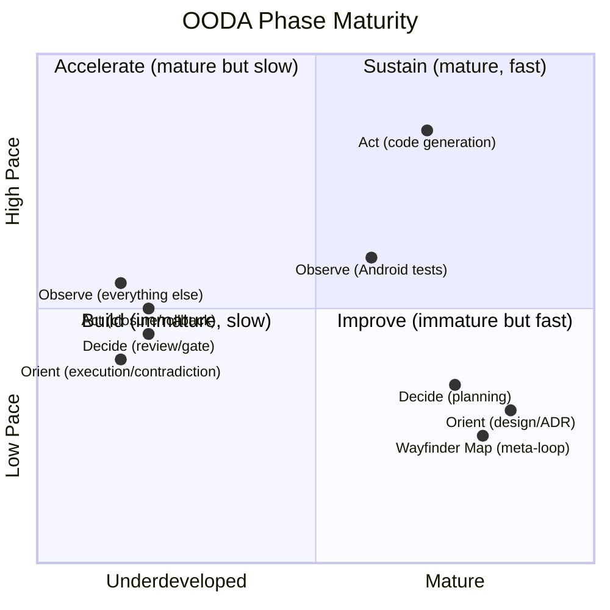
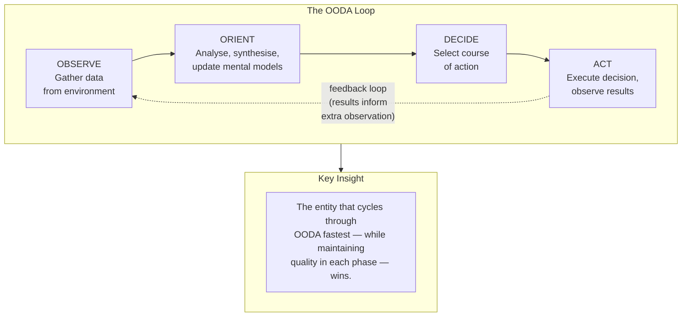
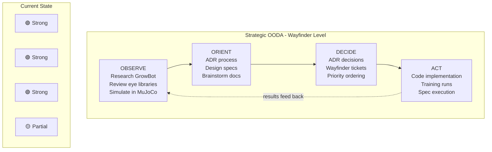
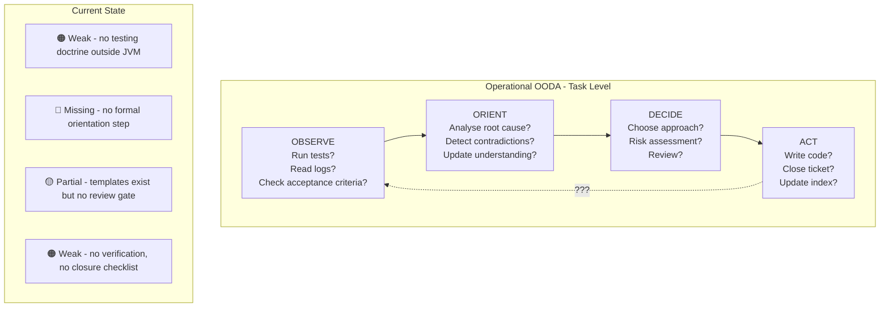
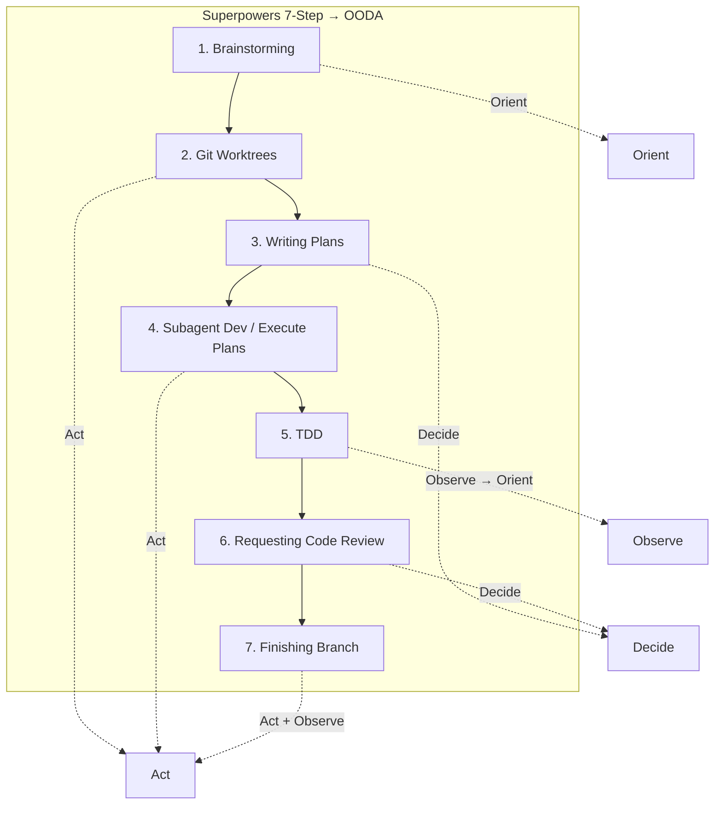
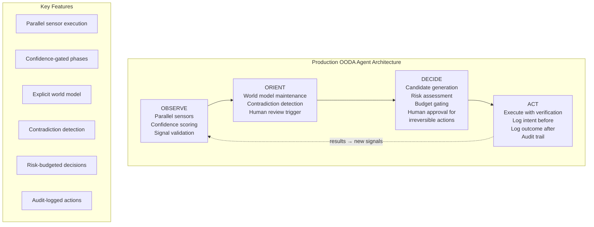
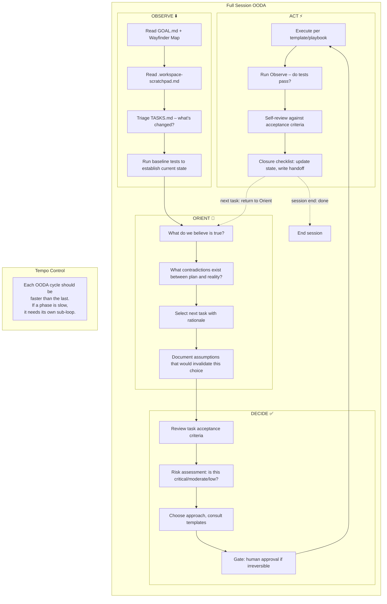
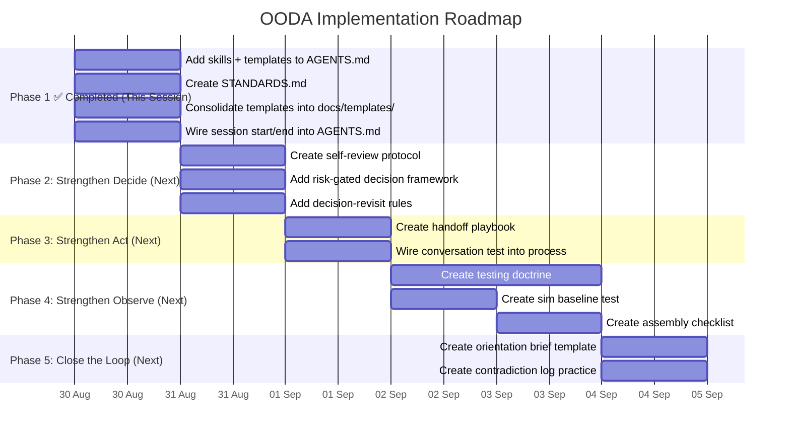

# Process Coherence Review: SMOLCASE Human-Agent Collaboration Framework

**Date:** 2026-08-30
**Author:** AI-assisted analysis (Dale Rogers / Crush)
**Framework:** OODA Loop (Observe → Orient → Decide → Act)
**Scope:** Full audit of collaborative coding processes, templates, conventions, skills, and AI agent integration against the OODA decision-making model, with evidence-based improvement recommendations.

---

## Table of Contents

1. [Executive Summary](#1-executive-summary)
2. [The OODA Framework & Why It Fits](#2-the-ooda-framework--why-it-fits)
3. [Methodology](#3-methodology)
4. [Current State: OODA Assessment](#4-current-state-ooda-assessment)
5. [External Reference Synthesis](#5-external-reference-synthesis)
6. [Recommendations: Strengthening Each OODA Phase](#6-recommendations-strengthening-each-ooda-phase)
7. [Proposed Architecture: OODA-Centric Workflow](#7-proposed-architecture-ooda-centric-workflow)
8. [Implementation Roadmap](#8-implementation-roadmap)

---

## 1. Executive Summary

SMOLCASE has an unusually strong *design-time* framework — ADRs, Wayfinder Map, specs-before-code, BDD gates — but a weak *execution-time* and *feedback* framework. Mapped onto OODA:

| OODA Phase | SMOLCASE Grade | What's Missing |
|------------|---------------|----------------|
| **Observe** | 🟠 Weak | No testing doctrine outside Android JVM; no automated conversation regression; no hardware inspection protocol |
| **Orient** | 🟢 Strong (design) but 🔴 Weak (execution) | Excellent at upfront analysis (ADRs, research); zero failure-mode analysis, no contradiction detection, no structured orientation phase during execution |
| **Decide** | 🟡 Partial | ADRs and templates support good decisions, but no review process validates decisions before acting; no risk gating |
| **Act** | 🟢 Strong (code generation) but 🟠 Weak (closure) | Agent writes effectively, but no rollback plan, no verification gate, no handoff on session end |

**The core problem:** The project runs a single OODA loop at the Wayfinder/planning level (slow, deliberate, high-quality) but has *no operational OODA loop* at the task execution level. Each task is entered and exited without observing results, orienting on contradictions, or gating decisions through review.



---

## 2. The OODA Framework & Why It Fits

### 2.1 What OODA Is

The OODA loop is a decision-making framework developed by US Air Force strategist John Boyd. It describes how entities navigate uncertainty and outmanoeuvre opposition through four continuous phases:



**The Orient phase is what makes OODA different.** It's not just "analyse the data" — it's an explicit world-model update step where you detect contradictions between new information and existing beliefs, reject unreliable observations, and update your understanding before acting. Boyd considered it the most important phase.

### 2.2 Why OODA for SMOLCASE

Boyd's framework maps onto three intrinsic characteristics of this project:

**1. The project is about navigating fog of war**
The Wayfinder Map already uses "fog of war" language — knowns, unknowns, unknown unknowns. OODA was *designed* for this. PDCA (Plan-Do-Check-Act) assumes you know what "plan" means. OODA assumes you're in a contested, uncertain environment where your mental model is provisional and must be updated constantly.

**2. Tempo is the strategic advantage**
Boyd's central insight: speed through the loop matters more than perfection in any single phase. A project that cycles OODA in hours beats one that cycles in days, even if the slower loop makes better individual decisions. For a solo builder + AI agent, the agent's ability to collapse observation-to-action time is the primary productivity lever.

**3. The Orient phase is the differentiator**
Most coding workflows have Observe (read logs, run tests) and Act (write code). Many have Decide (choose approach). Almost none have a formal Orient phase — yet Boyd considered it the most important. Orient is where you:
- Detect contradictions between new data and existing mental models
- Update your world model with new information
- Test assumptions before deciding
- Reject or downgrade unreliable observations

SMOLCASE's broken memory recall (bug 20260830-003) is fundamentally an Orient failure — the LLM receives memory data but doesn't integrate it into its working model.

### 2.3 How OODA Differs from PDCA

| Dimension | PDCA | OODA |
|-----------|------|------|
| Core assumption | We know what "plan" means | We're in contested, uncertain terrain |
| Mental model | Fixed at plan phase | Continuously updated (Orient) |
| Contradiction handling | Check phase finds variance | Orient phase actively seeks contradictions |
| Speed model | Fixed cycle time (sprints) | Tempo varies by situation |
| Best for | Known processes, optimisation | Novel problems, uncertainty, rapid adaptation |
| Role of feedback | Results → adjust plan | Results → update world model → new decisions |

### 2.4 OODA Phase Detail

#### Observe

**What it is:** Gathering raw data from the environment without interpretation. Multi-signal, parallel sensing.

**In software:** Run tests, check logs, read error messages, scan codebase state, gather metrics, capture system output.

**Key question:** *What is actually happening?*

**Pitfall:** Getting stuck in Observe — collecting more data instead of moving to Orient. "Just one more log line" syndrome.

#### Orient (the most important phase)

**What it is:** The synthesis phase. New observations are filtered through existing mental models, experience, and analysis. Contradictions are detected. The world model is updated. Boyd described it as a "many-sided, implicit cross-referencing process of projection, empathy, correlation, and rejection."

**In software:** Analyse root cause, detect contradictions between expected and actual behaviour, update understanding of the system, test assumptions, integrate new information with existing knowledge.

**Key question:** *What does this mean? Does it contradict what I believed?*

**Pitfall:** Confirmation bias — fitting observations to existing beliefs rather than updating beliefs.

#### Decide

**What it is:** Selecting a course of action from generated candidates. In mature OODA implementations, this includes risk assessment, cost/reversibility analysis, and human gates for high-stakes decisions.

**In software:** Choose a fix approach, select an implementation strategy, decide whether to escalate, prioritise among options.

**Key question:** *What should we do about it?*

**Pitfall:** Analysis paralysis — cycling Orient-Decide without Acting. Perfectionism masquerading as thoroughness.

#### Act

**What it is:** Executing the decision and observing the results. Includes verification (did it work?) and audit logging (what was intended vs. what happened?).

**In software:** Write code, deploy changes, run commands, flash firmware, merge branches. Then: verify the fix, observe the new state.

**Key question:** *Did it work? What changed?*

**Pitfall:** Acting without verifying. Assuming done means done without checking.

---

## 3. Methodology

### 3.1 Internal Audit

The full project tree was assessed against four OODA phases across two levels:

| Level | Focus | OODA Cycle Time |
|-------|-------|-----------------|
| **Wayfinder (Strategic)** | Overall project direction, architecture decisions | Days to weeks |
| **Task (Operational)** | Individual ticket execution, session workflow | Minutes to hours |

### 3.2 External References

Eight external sources were researched for transferable patterns:

| Source | Key Pattern Extracted | OODA Phase |
|--------|----------------------|------------|
| [Superpowers](https://github.com/obra/superpowers) | 7-step development workflow as executable playbook; verification-before-completion gate; brainstorming-to-closure pipeline | All phases — best reference for operational OODA |
| [Matt Pocock Skills](https://github.com/mattpocock/skills) | Categorized playbooks; handoff protocol; writing-for-agents documentation | Orient (structured analysis), Act (handoff) |
| [GitHub Spec Kit](https://github.com/github/spec-kit) | `/converge` loop; template priority system; constitution concept | Decide (template choice), Act (converge verification) |
| [LangChain / LangGraph](https://www.langchain.com/resources/ai-agent-frameworks) | Stateful graphs with checkpointing; ADL loop (traces → datasets → evals) | Orient (stateful world model), Decide (checkpoints) |
| [Mastra](https://mastra.ai/) | 4-tier memory model; evaluation harness; graph workflow engine | Orient (memory as world model), Observe (evals) |
| [OODA Agent Architecture](https://superml.dev/ooda-loop-architecture-production-ai-agents-2026) | Explicit Orient phase with world model, contradiction detection, risk-gated Decide, audit-logged Act | **All phases — the most directly relevant reference** |
| [DevOps OODA Application](https://www.copado.com/resources/blog/how-the-ooda-loop-decision-making-model-drives-devops-success) | Shift-left testing accelerates Observe; iterative OODA cycles for defect resolution | Observe (shift-left), Act (iterate) |
| [Framework Comparison](https://www.speakeasy.com/blog/ai-agent-framework-comparison/) | Token budgets; debuggability as first-class concern; modular agent design | Orient (debugging = contradiction detection), Decide (budgets as risk gating) |

---

## 4. Current State: OODA Assessment

### 4.1 Strategic Level (Wayfinder)



**At the strategic level, OODA is functioning well.** The ADR process is a formal Orient phase. The Wayfinder Map is a structured Decide phase. Research documents are thorough Observes. This design-time loop is the project's strongest asset.

**Vulnerability:** No "re-Orient" trigger. Once an ADR is accepted, it's never revisited until someone notices it's wrong. The strategic loop runs once per decision, not continuously.

### 4.2 Operational Level (Task Execution)



**At the task execution level, OODA is broken.** The project has no operational Observing (what tests to run before acting), no formal Orient (just start coding), inconsistent Decide (templates exist but aren't enforced), and incomplete Act (no verification that the fix worked, no project state update).

**This is where the 9 recommendations in this report are targeted.**

### 4.3 Template-to-OODA Mapping

The 8 templates map naturally onto OODA phases — revealing which phases are well-served and which are bare:

| Phase | Templates | Coverage |
|-------|-----------|----------|
| **Observe** | Bug, Incident, Spike | 🟢 Strong — three templates for different observation modes |
| **Orient** | ADR, Epic, Feature | 🟢 Strong — ADR is a formal orientation document |
| **Decide** | User Story, Task | 🟡 Partial — templates capture decisions but no review process validates them |
| **Act** | *None* | 🔴 Missing — no closure checklist, no verification template, no handoff document |

### 4.4 The Feedback Loop Gap

The most critical finding: **there is no closed feedback loop at the operational level.**

The conversation quality bugs (20260830-001 through -006) are well-documented but have no feedback mechanism to verify fixes stuck. The `test_conversation.sh` script exists but is not wired into any quality gate. This is an open-loop system — information flows out but never back in.

**OODA insight:** A loop that doesn't close is not a loop. Without Observe (did the fix work?) feeding back into Orient (what does this new data mean?), the Decide (should we close the ticket?) and Act (close it) phases are operating without information.

---

## 5. External Reference Synthesis

### 5.1 Superpowers: The 7-Step Operational OODA

Obra's Superpowers is the closest existing implementation of an OODA-driven development workflow. Its 7 steps map directly:



**Key transferable patterns:**
- Each step is a defined skill file the agent loads and executes — the workflow is *executable*, not descriptive
- Brainstorming (Orient) explicitly precedes planning (Decide) — no jumping to Act
- TDD is positioned as Observe/Orient (test failure reveals contradiction between expectation and reality)
- Code review is a Decide gate before Act (merge)
- Branch finishing includes cleanup — Act is not complete until the workspace is clean

### 5.2 OODA Agent Architecture: The Gold Standard

The production OODA agent architecture (superml.dev) provides the most rigorous implementation:



**Lessons directly applicable to SMOLCASE:**

1. **Orientation is the most important phase.** The article's key finding: "The most significant bugs in production AI agents often stem from a miscalibrated Orientation Layer — discrepancies between what the agent believes and reality." This maps precisely to SMOLCASE bug 20260830-003 (memory recall failure).

2. **Contradiction detection prevents compounding errors.** Before updating the world model, the architecture explicitly checks whether new observations contradict existing beliefs. If they do, it surfaces the conflict rather than silently overwriting. SMOLCASE's agent has no equivalent — it accepts new information without cross-referencing.

3. **Risk-gated decisions prevent costly mistakes.** The architecture refuses to decide if orientation confidence is too low. It assesses reversibility and cost before acting. Irreversible actions require human approval tokens. SMOLCASE has no equivalent — the decision to print a wrong part is made with the same process as choosing a variable name.

4. **Audit logging captures intent vs. outcome.** The architecture logs *before* acting (what was intended) and *after* acting (what happened). The disparity is a goldmine for debugging. SMOLCASE's conversation JSONL logs latency but not intent.

### 5.3 Mastra: Memory as World Model

Mastra's 4-tier memory model is directly relevant to SMOLCASE's broken memory recall:

```mermaid
flowchart LR
    subgraph MastraMemory[Mastra 4-Tier Memory]
        M1[Message History\nLast N turns\nWorking context] --> M2[Working Memory\nExtracted current state\nTask progress]
        M2 --> M3[Semantic Recall\nVector search\nPast learnings]
        M3 --> M4[RAG\nExternal knowledge\nDocuments]
    end

    subgraph SMOLCASE[SMOLCASE Current]
        S1[MemoryStore\nsoulSummary()\n→ flat text dump]
        S2[ConversationEngine\nStateless per-turn]
    end

    MastraMemory -. "SMOLCASE needs a structured\nmemory hierarchy, not a flat dump" .-> SMOLCASE
```

**Key insight:** SMOLCASE's `MemoryStore` produces a flat text dump appended to the prompt. Mastra's model suggests a tiered approach where different memory types serve different Orient needs — recent conversation context (working memory), user preferences (semantic recall), and external knowledge (RAG). The `soulSummary()` should be one layer, not the entire memory system.

### 5.4 Spec Kit: The Decide Phase Workflow

Spec Kit's `/specify → /plan → /tasks → /implement → /converge` cycle maps onto OODA:

| Spec Kit Step | OODA Phase | Purpose |
|--------------|------------|---------|
| `/specify` | Orient | Define requirements — build mental model of what's needed |
| `/plan` | Decide | Choose technical approach |
| `/tasks` | Decide | Break plan into ordered actions |
| `/implement` | Act | Execute tasks |
| `/converge` | Observe → Orient | Assess implementation against spec, detect gaps, append remaining work |

The `/converge` step is particularly important — it's a formal re-Observe/re-Orient gate that prevents the "open loop" problem. SMOLCASE needs an equivalent.

### 5.5 Key Insights Summary

| Source | What to Steal | Which OODA Phase |
|--------|--------------|------------------|
| Superpowers | Executable 7-step playbook; verification-before-completion | All phases (operational level) |
| OODA Agent Architecture | World model; contradiction detection; risk-gated decisions; audit logging | Orient, Decide, Act |
| Mastra | Tiered memory model (message history + working memory + semantic recall + RAG) | Orient |
| Spec Kit | `/converge` verification loop; template priority system | Observe, Decide |
| Matt Pocock | Task-specific playbook files; handoff protocol; writing-for-agents | All phases |
| DevOps OODA | Shift-left testing; iterative OODA cycles for defect resolution | Observe, Act |

---

## 6. Recommendations: Strengthening Each OODA Phase

### 6.1 Strengthen Observe

**Current state:** Only Android JVM tests have a defined observation protocol. No automated observation for simulation, firmware, hardware, or conversation quality.

**Target state:** Every subsystem has a defined observation mechanism that the agent runs before and after acting.

| Subsystem | Observation Method | When to Run | Threshold |
|-----------|-------------------|-------------|-----------|
| Android / Kotlin | `./gradlew test` | Before merge, after any Kotlin change | 100% pass |
| MuJoCo simulation | `python3 sim/src/test_xml_load.py` | Before training, after XML change | Loads without error |
| PPO policies | `smolcase_train.py --mode eval` | After training, before export | Walk forward >5m |
| Conversation quality | `scripts/test_conversation.sh` | Before closing any conversation bug | All prompts valid TARS register |
| Hardware assembly | `mech/assembly-checklist.md` | After assembly, before first power-on | All dims within print tolerance |
| BLE firmware | PlatformIO `test` | Before flash, after firmware change | Compiles, test sequence passes |

**Concrete actions:**
1. Create `docs/process/testing-doctrine.md` documenting per-subsystem test requirements
2. Wire `test_conversation.sh` into the bug closure checklist
3. Create a `sim/src/test_sim_baseline.py` script that runs a simple CPG eval and checks expected metrics
4. Create `mech/assembly-checklist.md` for first-article hardware inspection

### 6.2 Strengthen Orient

**Current state:** Excellent at strategic Orient (ADRs, research, brainstorms). Non-existent at operational Orient (no contradiction detection, no world model maintenance, no assumption testing before acting).

**Target state:** Every task has a structured Orient phase before Decide — checking for contradictions, updating mental models, testing assumptions.

**Key Orient patterns to adopt:**

**Pattern 1: Orientation at task open**
Before starting any task, the agent should:
1. State what it believes to be true about the current state
2. Identify contradictions between task requirements and current system state
3. Document assumptions that would invalidate the approach if wrong
4. Review related ADRs, specs, and tickets for relevant context

**Pattern 2: World model maintenance**
The wayfinder-map.md serves as the strategic world model. It should be updated whenever new information changes the project's understanding — not just when a ticket is closed.

**Pattern 3: Contradiction recognition**
The agent should actively watch for:
- New test failure that contradicts "this subsystem works"
- Performance regression that contradicts "latency is fixed"
- New research that contradicts an ADR's assumptions
- User feedback that contradicts "this feature is complete"

**Concrete actions:**
1. Add an "Orientation" section to AGENTS.md with the three patterns above
2. Add contradiction detection to the session start playbook
3. Create a "world model update" trigger: when new empirical data arrives, update relevant documentation before proceeding
4. The wayfinder-map.md "decisions so far" section should include a "last validated" date for each decision

### 6.3 Strengthen Decide

**Current state:** Templates support decision-making but no review process validates decisions before acting. No risk assessment. No "choose not to decide" option.

**Target state:** Every decision is reviewed, risk-assessed, and gated before moving to Act.

**Risk assessment framework:**

| Risk Level | Criteria | Gate Required | Examples |
|-----------|----------|--------------|---------|
| 🔴 Critical | Irreversible, costly, or breaking | Human approval | Ordering parts, merging to main, flashing firmware |
| 🟡 Moderate | Reversible but time-consuming | Self-review checklist | Code changes, training runs, spec updates |
| 🟢 Low | Easily reversible | None — proceed | Documentation edits, refactoring, test additions |

**Concrete actions:**
1. Add a "Decision Gate" section to AGENTS.md with risk levels and approval requirements
2. Create `docs/process/self-review.md` with the two-tier severity system (blocking vs. non-blocking)
3. Add risk-level tagging to task template: `risk: [low | moderate | critical]`

### 6.4 Strengthen Act

**Current state:** Code writing is fast and effective. Closure is weak — no verification that the fix worked, no handoff, no project state update.

**Target state:** Every Act is verified, logged, and closed with a complete state update.

**The closure checklist:**

```markdown
## Closure Checklist

Before closing any task, verify each item:

- [ ] **Observe:** All subsystem tests pass
- [ ] **Orient:** Acceptance criteria reviewed and confirmed satisfied
- [ ] **Orient:** No contradictions introduced (new failures, regressions, outdated docs)
- [ ] **Decide:** Self-review completed (author walkthrough + edge case check)
- [ ] **Act:** Code committed with descriptive message
- [ ] **Act:** TASKS.md updated (move ticket to completed, update status)
- [ ] **Act:** PROJECT_INDEX current (new docs linked, status changes reflected)
- [ ] **Act:** Wayfinder map updated if decision changed
- [ ] **Act:** Handoff written (if mid-session) or session documented (if session end)
```

**Concrete actions:**
1. Create `docs/process/closure-checklist.md` as a reusable checklist file
2. Create `docs/playbooks/handoff.md` defining the handoff document structure
3. Add verification-before-completion as a formal step in AGENTS.md §1.2

---

## 7. Proposed Architecture: OODA-Centric Workflow

> **Post-analysis update (2026-08-30):** The recommendations below were partially superseded by implementation. Rather than creating a `docs/process/` directory with 7 separate files, we collapsed everything into two files:
> - **`STANDARDS.md`** — absorbs constitution, closure-checklist, self-review, testing-doctrine, failure-modes, and session start/end playbooks into a single document with clear sections
> - **`AGENTS.md`** — session workflow (start/end/closure) embedded directly into §1; available skills and template reference added as §2
>
> The OODA-centric workflow below remains valid as conceptual architecture. The implementation is lighter.

### 7.1 The Full OODA Workflow



### 7.2 Human and Agent Roles in OODA

| Phase | Agent Does | Human Does | Tempo |
|-------|-----------|------------|-------|
| **Observe** | Gather data from all available sensors (tests, logs, grep, git) | Provides subjective observations (visual inspection, feel, intuition) | Fast — agent runs observed in parallel |
| **Orient** | Synthesises findings, detects contradictions, documents assumptions | Validates synthesis, provides missing context, corrects misinterpretation | Medium — human judgement is the bottleneck |
| **Decide** | Generates options with risk assessment and recommendation | Approves or selects, especially for irreversible actions | Medium — gated by human response time |
| **Act** | Executes approved plan, writes code, runs commands, verifies results | Merges branches, flashes hardware, makes purchases, closes high-risk items | Fast — agent executes autonomously once decision is made |

### 7.3 Template-to-OODA Mapping (Updated)

| Template Type | OODA Phase | Purpose |
|--------------|------------|---------|
| Bug, Incident, Spike | Observe | Capture raw evidence from the environment |
| ADR, Epic, Feature | Orient | Analyse context, build mental models, define scope |
| User Story, Task | Decide | Select acceptance criteria, plan execution |
| *(Closure checklist)* | Act | Verify, update state, handoff |

### 7.4 Directory Structure Evolution

> **Actual outcome:** Rather than creating `docs/process/` and `docs/playbooks/`, we embedded all process content into `STANDARDS.md` and `AGENTS.md` — fewer files, same coverage, discoverable from root.

```
SMOLCASE/
├── docs/
│   ├── templates/                  ← CREATED: all templates consolidated here
│   │   ├── adr-template.md
│   │   ├── bug-template.md
│   │   ├── epic-template.md
│   │   ├── feature-template.md
│   │   ├── incident-template.md
│   │   ├── spike-template.md
│   │   ├── task-template.md
│   │   └── us-template.md
│   ├── 03-decisions/               ← existing (ADR template also copied to templates/)
│   ├── ... (all existing docs/)
│   └── analysis/                   ← NEW (this report)
├── STANDARDS.md                    ← CREATED: absorbs all proposed process/ and playbooks/
│                                      content — document standards, code standards,
│                                      session start/end, closure checklist, self-review,
│                                      testing doctrine, failure modes, risk gating
├── AGENTS.md                       ← UPDATED: session start/end, skills table,
│                                      template reference, closure gate
├── _tasks/                         ← existing
├── TASKS.md                        ← existing
├── GOAL.md                         ← existing
└── PROJECT_INDEX.md                ← UPDATED
```

### 7.5 Quick Wins (This Session)

| Action | Files changed | Status |
|--------|----------------|--------|
| Wire skills + templates into AGENTS.md | `AGENTS.md` | ✅ Done |
| Create STANDARDS.md (constitution, closure checklist, failure modes, session playbooks, testing doctrine, self-review) | `STANDARDS.md` | ✅ Done |
| Consolidate templates into `docs/templates/` | 8 template files moved | ✅ Done |
| Update PROJECT_INDEX with new refs | `PROJECT_INDEX.md` | ✅ Done |

---

## 8. Implementation Roadmap

### 8.1 Priority-Ordered Action List

> **Status as of 2026-08-30:** Phase 1 items were completed this session. Phases 2–5 remain.



### 8.2 Summary: OODA Before and After

| Without OODA | With OODA |
|-------------|-----------|
| Start coding immediately | Orient first: what do we believe? What contradicts? |
| No test baseline before starting | Observe first: run baseline to establish current state |
| Fix without verifying | Act includes verification: did it work? |
| Close ticket, lose context | Closure checklist: update index, write handoff |
| No failure mode planning | Failure mode reference: what could go wrong, what to do |
| Single speed of work | Layered loops: fast for micro, slow for strategic |
| Human and agent blur roles | Clear OODA phase ownership: who does what when |

### 8.3 The OODA Metric: Tempo

The ultimate measure of this framework's success is **tempo** — how fast a complete Observe-Orient-Decide-Act cycle takes at each level.

| Loop Level | Current Cycle Time | Target Cycle Time | Metric |
|-----------|-------------------|-------------------|--------|
| **Micro** (within-action) | 30s-2min (implicit) | Same, but explicit | Agent less stuck, fewer clarification requests |
| **Operational** (task-level) | Unmeasured | 15-30 min per cycle | Task completion rate per session |
| **Strategic** (Wayfinder) | 1-2 weeks per ticket | Same (deliberate is good) | Tickets closed per week |

**The goal:** A closed OODA loop at every level. Not faster decisions — faster *feedback*. The project's strength is already strategic deliberation (Orient). The gains are in operational Observe (does it work?) and operational Act (did we update state?).

---

## Appendix A: OODA Quick Reference

```mermaid
flowchart TD
    subgraph QuickRef[OODA Loop: Quick Reference Card]
        direction TB

        O[OBSERVE\n"What is actually happening?"\nTests, logs, metrics, codebase state] --> R[ORIENT\n"What does this mean?"\nAnalyse, detect contradictions,\nupdate world model]

        R --> D[DECIDE\n"What should we do?"\nGenerate options, risk assess,\nself-review, gate]

        D --> A[ACT\n"Did it work?"\nExecute, verify, update state,\nwrite handoff]

        A -. "feedback" .-> O
    end

    subgraph Blocks[When to pause]
        B1[Orient: contradiction with high severity]\n→ pause for human review
        B2[Decide: irreversible action]\n→ pause for human approval
        B3[Act: verification fails]\n→ pause, return to Orient
    end
```

## Appendix B: Glossary

| Term | Definition |
|------|-----------|
| **OODA** | Observe, Orient, Decide, Act — a decision-making framework developed by John Boyd |
| **Orient** | The synthesis phase of OODA where new data is filtered through mental models, contradictions are detected, and understanding is updated — considered by Boyd to be the most important phase |
| **Tempo** | The speed at which an entity cycles through OODA. Boyd's key insight: the entity that cycles fastest while maintaining quality wins |
| **World model** | A structured representation of current understanding — what the agent/human believes to be true about the system state |
| **Contradiction detection** | The process of checking whether new observations conflict with the existing world model before updating it |
| **Risk gate** | A decision checkpoint that evaluates reversibility and cost before allowing an action to proceed |
| **Fog of war** | The uncertainty inherent in any complex project — knowns, known unknowns, and unknown unknowns |
| **PDCA** | Plan-Do-Check-Act — an iterative management method, distinct from OODA in that it assumes a stable planning context |
| **ReAct** | Reasoning + Acting — a simpler agent pattern where the agent reasons about a situation then acts, without OODA's explicit Orient phase and world model maintenance |
| **ADL** | Agent Development Lifecycle — feedback loop of traces → datasets → evals → improvements |
| **ADR** | Architecture Decision Record |
| **BDD** | Behaviour-Driven Development (Given/When/Then) |
| **HITL** | Human-in-the-Loop — a design pattern where humans are explicitly included in the decision loop for high-stakes actions |

## Appendix C: Source Reference Summary

| Source | URL | Contribution to Framework |
|--------|-----|--------------------------|
| OODA Agent Architecture | https://superml.dev/ooda-loop-architecture-production-ai-agents-2026 | Production OODA implementation with world model, contradiction detection, risk-gated decisions, audit logging |
| DevOps OODA | https://www.copado.com/resources/blog/how-the-ooda-loop-decision-making-model-drives-devops-success | Shift-left testing accelerates Observe; iterative OODA for defect resolution |
| Autonomous AI OODA | https://dev.to/yedanyagamiaicmd/the-ooda-loop-pattern-for-autonomous-ai-agents-how-i-built-a-self-improving-system-2ap3 | Multi-agent OODA with knowledge graphs, belief decay, human approval thresholds |
| OODA in Cybersecurity | https://www.securityweek.com/the-ooda-loop-the-military-model-that-speeds-up-cybersecurity-response/ | Tempo-based advantage; risk of getting "stuck on Observe" |
| Bruce Schneier on Agentic OODA | https://www.schneier.com/blog/archives/2025/10/agentic-ais-ooda-loop-problem.html | Trustworthy observation as a challenge for AI OODA loops |
| Superpowers | https://github.com/obra/superpowers | 7-step executable workflow; verification-before-completion; brainstorming-to-closure pipeline |
| Matt Pocock Skills | https://github.com/mattpocock/skills | Categorized playbooks; handoff protocol; writing-for-agents |
| GitHub Spec Kit | https://github.com/github/spec-kit | `/converge` loop; template priority; constitution concept |
| LangChain Frameworks | https://www.langchain.com/resources/ai-agent-frameworks | ADL loop (traces → datasets → evals); stateful graphs with checkpointing |
| Mastra | https://mastra.ai/ | 4-tier memory model; evaluation harness; graph workflow engine |
| Speakeasy Comparison | https://www.speakeasy.com/blog/ai-agent-framework-comparison/ | Modular agent design; token budgets; debuggability as first-class concern |
| Agent Report | https://the-agent-report.com/2026/05/ultimate-guide-open-source-ai-agent-frameworks/ | Specialization by domain; memory sophistication; production readiness vs. popularity |