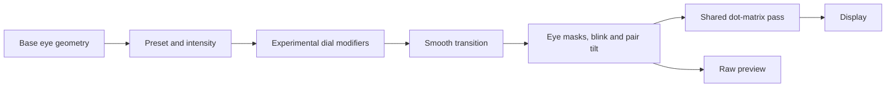

# SMOLCASE Face Expressions

## Question

Which eye expressions remain distinguishable through a 38 x 68 display?

This is an eye-only visual experiment, not an emotion-recognition system. Names describe intended readings for Dale to assess. It does not modify the Android app or sphere source spike.

Related: [[_tasks/20260909-003-face-expressions]], [[spikes/20260909-dot-matrix-viewport/README]], [[spikes/20260909-smolcase-face/README]], [[spikes/20260909-face-expressions/findings]].

## Reference and scope

[User-supplied expression table](assets/expression-table-reference.png).

The table contributes eye shape cues, not complete emoji faces:

| Preset | Eye-only interpretation |
|---|---|
| HAPPY | Rounded upward arches |
| EMBARRASSED | Smaller, shallower arches |
| LAUGHING | Mirrored squeezed chevrons |
| HEART | Filled heart silhouettes |
| ANGRY | Top lids descend towards the centre |
| SHOCKED | Tall, fully open solid eyes |
| SMUG | Low, almost-horizontal top lids |
| SAD | Inner lid ends lift, opposite to angry |
| EXHAUSTED | Nearly flat, drooping strokes |
| SLEEPING | Closed resting curves |

NEUTRAL, SKEPTICAL, CURIOUS, DROWSY, ALERT and THINKING are retained. There are 16 presets in total. Additional names are exploratory, not newly implemented Android states.

No pupils, specular glints, mouths, tears, sweat, cheek shading or floating icons. Some emotions depend on those excluded cues in the reference, so an eye-only translation may be ambiguous.

## Implementation



The shader combines approximate ellipse/lid fields, rounded curve strokes, segment-distance chevrons and a heart distance field. This is not an exact port of Android's CozmoEyeParams.

The shared pass is imported from `../shared/dot-matrix-shader.js`. The viewport spike's shader and locked defaults are unchanged by this iteration.

## Sphere mapping

The `Map eyes onto the sphere` control changes the source from a flat pair to the sphere model from the face spike: a front hemisphere disc, lit from below-left, carrying the same eye masks.

For each screen pixel the shader projects onto the sphere, then applies the inverse gaze rotation, so the pattern is fixed to the surface rather than to the screen. Consequences:

- Eyes foreshorten towards the silhouette, as a decal on a curved surface would.
- Gaze (mouse or WASD, plus yaw/pitch range) rotates the sphere, and the eyes rotate with it.
- Once a pattern passes the horizon (`z <= 0`) it is hidden, so eyes disappear around the sides instead of wrapping.
- Sphere radius and centre Y are in height-normalised screen units. Defaults (0.167 and 0.695) match the face spike's radius 2.4 at height 2.8 with a 3.2 half-width camera.

This is an analytic projection in the shader, not the face spike's 3D sphere mesh. The face spike is unmodified, and flat mode is unchanged when sphere mapping is off.

## Controls

- **Mood / intensity:** preset targets blend with the base. Zero intensity equals neutral at the same base settings and dials, including size and shape-family weights.
- **Face tilt:** rotates the whole eye pair around its centre, reproducing angled variants without duplicating presets.
- **Base geometry:** size, spacing, asymmetry, lids, slope, curve stroke, shear and softness. Presets may override selected base values at full intensity; reduce intensity or select neutral to inspect base edits directly.
- **Dials:** experimental visual modifiers, not a claim of Android formula parity.
- **Bypass viewport:** inspect raw shapes versus the dot matrix.
- **Sphere mapping, radius, centre Y, gaze yaw/pitch:** see above. Gaze uses mouse position over the canvas or WASD.
- **Blinking / micro-saccade:** disable both for repeatable comparisons.
- **Capture / Apply:** JSON preserves the selected mood, tilt, base, optics and toggles. Save PNG exports the current canvas.

Source shapes are clipped to the upper screen half. Emitter glow may spread beyond the source boundary.

## Run

From the repository root:

```bash
python3 -m http.server 8000 --bind 127.0.0.1 --directory .
```

Open http://localhost:8000/spikes/20260909-face-expressions/.

Three.js loads from the pinned CDN URL, so a network connection is required on first load.

## Verification

With Playwright installed and resolvable by Node:

```bash
node spikes/20260909-face-expressions/test-expressions.cjs
```

`NODE_PATH` can point to an existing Playwright installation. `BASE_URL` and `OUTPUT_DIR` override the page and output locations. Default captures go to `/tmp/smolcase-expression-table/`.

The test drives browser controls, captures every preset in raw and dot modes, compares all presets at zero intensity, round-trips a tilted heart and downloads a PNG. It does not test whether a human recognises the intended emotions.

## Evidence

- [Sphere, heart](evidence/sphere-heart-raw.png), [sphere, dot matrix](evidence/sphere-neutral-dots.png), [gaze left](evidence/sphere-gaze-left.png), [gaze right](evidence/sphere-gaze-right.png)
- [Raw comparison](evidence/contact-raw.png)
- [Dot-matrix comparison](evidence/contact-dots.png)
- [Machine results](evidence/results.json)
- [[spikes/20260909-face-expressions/findings|Observations and open questions]]
